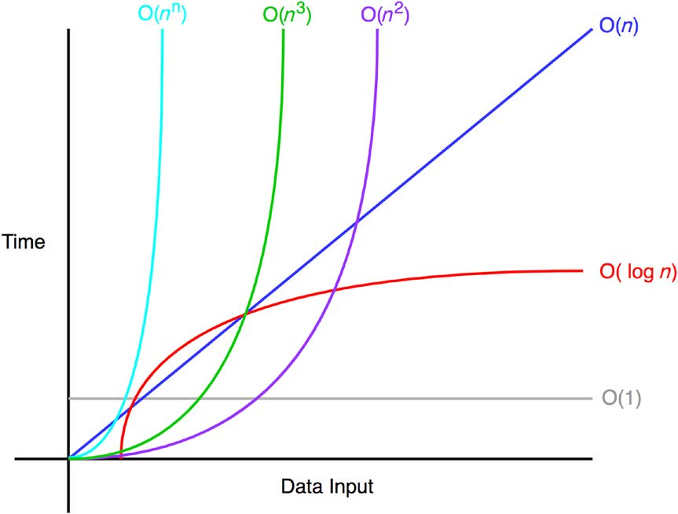

# Big O Notation

Used as a measurement for the worst case complexity of an algorithm.

<div>
Figure 1: A graph of common time complexities.</img>
</div>
## Common Examples

### O(1): Constant Time

Time complexity does not change with data input.

#### Example

```js
const example = (array) => console.log(array[0]);
example(["the", "quick", "brown", "fox", "jumps"]);
// "the"
```

## O(n): Linear Time

Time complexity rises linearly with data complexity.

#### Example

```js
const example = (n) => {
  for (let i; i < n; i++) {
    console.log(n);
  }
};
```

##
